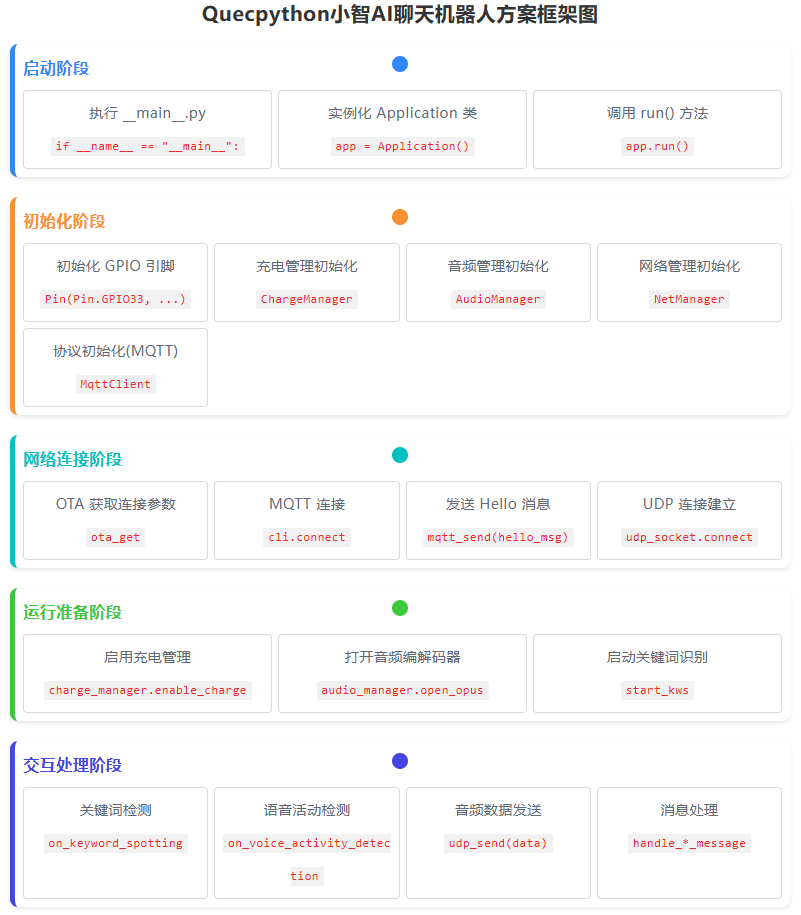
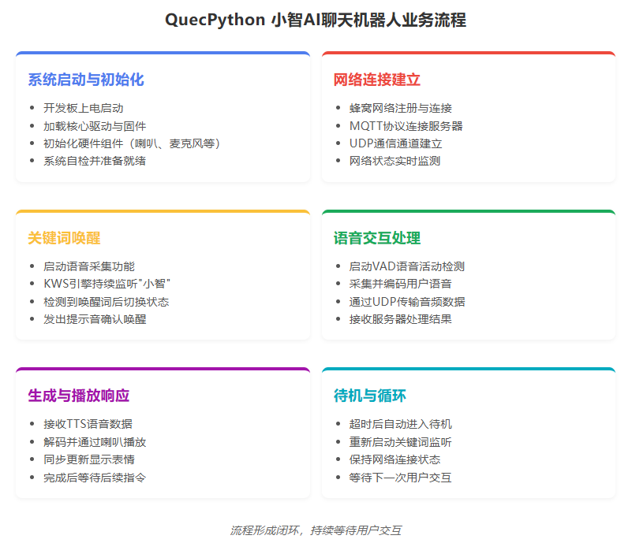
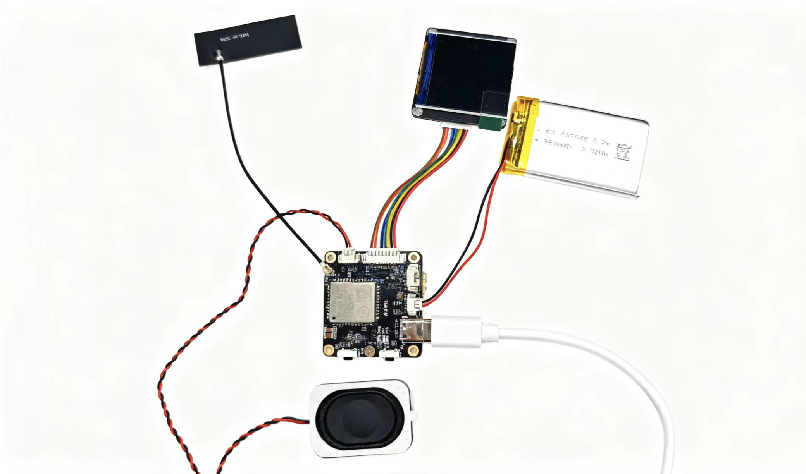
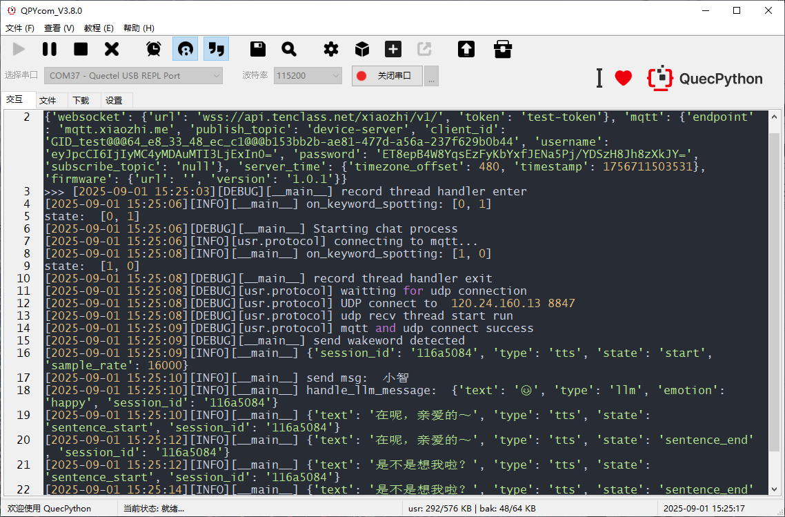

# QuecPython基于MQTT＋UDP的小智 AI 聊天机器人

## 目录

- [介绍](#介绍)
- [仓库目录](#仓库目录)
- [方案框架](#方案框架)
- [功能特性](#功能特性)
- [快速开始](#快速开始)
  - [先决条件](#先决条件)
  - [安装](#安装)
  - [运行应用程序](#运行应用程序)
- [贡献](#贡献)
- [许可证](#许可证)
- [支持](#支持)

## 介绍

QuecPython 推出了小智平台 AI 聊天机器人解决方案mqtt+udp版本。该方案基于 mqtt协议+udp协议，具有跨平台特性，可以适用于大部分 QuecPython 模组。

本案例采用搭载 EC800MCNLE 模组的 AI 开发板。

## 仓库目录

```plaintext
solution-xiaozhiAI_mqtt&udp/
├── fw/
	├── EC800MCNLER06A01M08_OCPU_QPY_TEST0810.zip       --------- firmware
├── media/                                              --------- picture 
│   ├── connection.png
│   └── ......
├── src/												--------- code
│	├── _main.py
│	├── protocol.py
│	├── ......
├── LICENSE
├── README.MD
```

##  方案框架





## 功能特性

- 支持语音中断/打断。
- 支持关键词语音唤醒。
- 使用 Python 语言，便于二次开发。

## 快速开始

### 先决条件

在开始之前，请确保您具备以下先决条件：

- **硬件：**
  - 联系移远官方获取 AI 开发板及配件。
  - 电脑（Windows 7、Windows 10 或 Windows 11）
  - 喇叭
    - 任意 2-5W 功率的喇叭即可
    - [移远商城购买链接](https://www.quecmall.com/goods-detail/2c90800b9488359c0195efe6367303b5)
  
- **软件：**
  - 调试工具 [QPYcom](https://developer.quectel.com/wp-content/uploads/2024/09/QPYcom_V3.9.0.zip)
  - QuecPython 固件（仓库 fw 目录下有 beta 固件）
  - Python 文本编辑器（例如，[VSCode](https://code.visualstudio.com/)、[Pycharm](https://www.jetbrains.com/pycharm/download/)）

### 安装

1. **克隆仓库**：
   ```bash
   git clone https://github.com/QuecPython/AIChatbot-Xiaozhi-Mqtt.git
   ```
   
3. **烧录固件：**
   按照[说明](https://developer.quectel.com/doc/quecpython/Getting_started/zh/4G/flash_firmware.html#%E7%83%A7%E5%BD%95%E5%9B%BA%E4%BB%B6)将固件烧录到开发板上。

### 运行应用程序

1. **连接硬件：**
   本案例采用移远 AI 开发板，如有需要请联系官方获取。按照下图进行硬件连接：
   
   
   
   1.  连接喇叭
   2. 连接天线
   3. 接入电池
   
4. 通过 Tpye-C 连接上位机
   
2. **将代码下载到设备：**
   - 启动 QPYcom 调试工具。
   - 将数据线连接到计算机。
   - 按下开发板上的 **PWRKEY** 按钮启动设备。
   - 按照[说明](https://developer.quectel.com/doc/quecpython/Getting_started/zh/4G/first_python.html#PC%E4%B8%8E%E6%A8%A1%E7%BB%84%E9%97%B4%E7%9A%84%E6%96%87%E4%BB%B6%E4%BC%A0%E8%BE%93)将 `src` 文件夹中的所有文件导入到模块的文件系统中，保留目录结构。

3. **运行应用程序：**
   
   - 选择 `File` 选项卡。
   - 选择 `_main.py` 脚本。
   - 右键单击并选择 `Run` 或使用`运行`快捷按钮执行脚本。
   
4. **关键词唤醒后，即可对话， 参考运行日志：**

   

## 贡献

我们欢迎对本项目的改进做出贡献！请按照以下步骤进行贡献：

1. Fork 此仓库。
2. 创建一个新分支（`git checkout -b feature/your-feature`）。
3. 提交您的更改（`git commit -m 'Add your feature'`）。
4. 推送到分支（`git push origin feature/your-feature`）。
5. 打开一个 Pull Request。

## 许可证

本项目使用 Apache 许可证。详细信息请参阅 [LICENSE](LICENSE) 文件。

## 支持

如果您有任何问题或需要支持，请参阅 [QuecPython 文档](https://developer.quectel.com/doc/quecpython/) 或在本仓库中打开一个 issue。