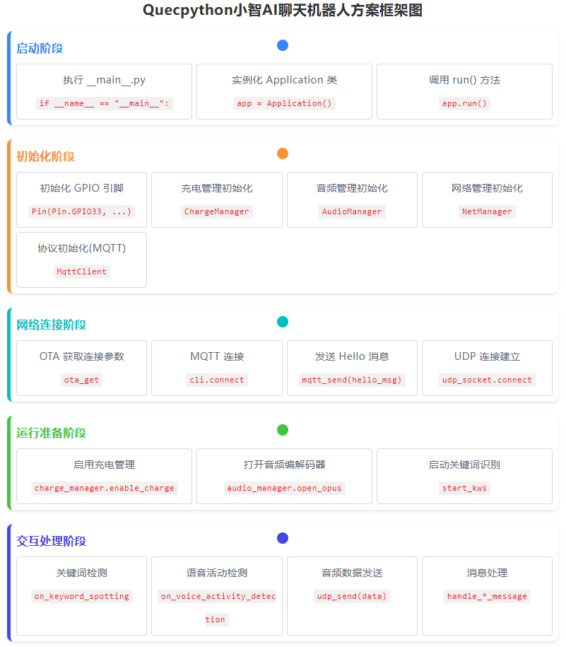
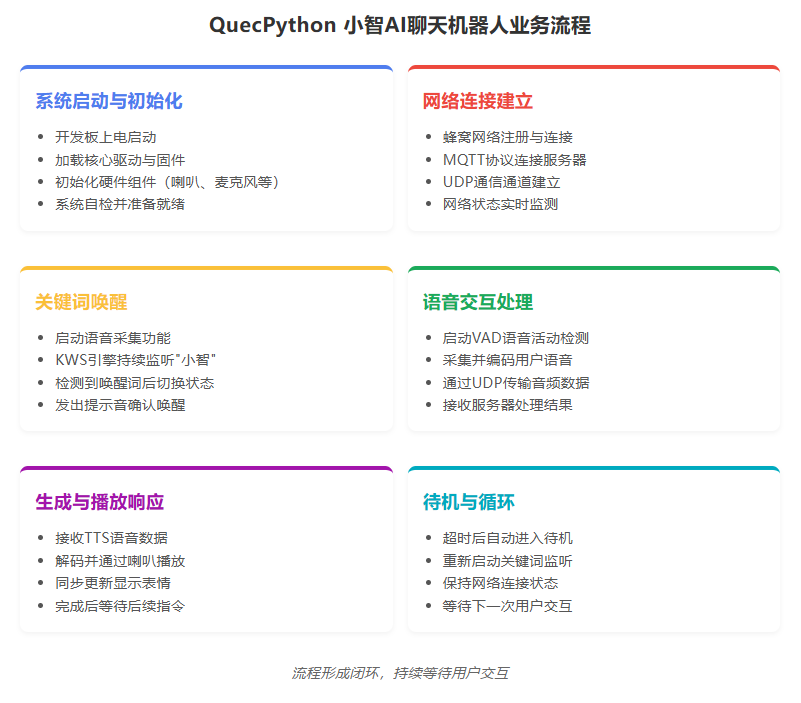
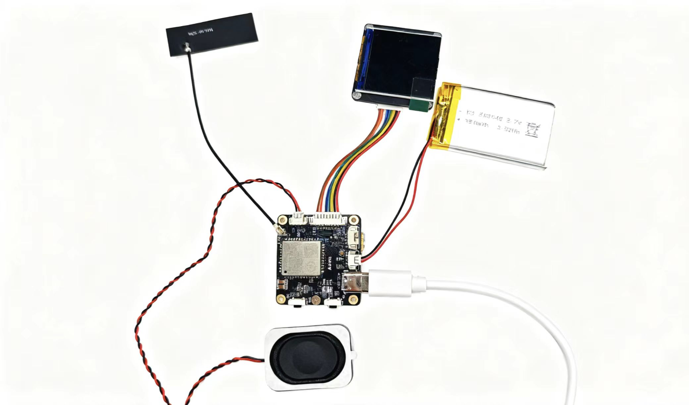

# QuecPython Xiaozhi AI Chatbot Based on MQTT + UDP

## Table of Contents

- [Introduction](#introduction)
- [Repository Structure](#repository-structure)
- [Solution Framework](#solution-framework)
- [Features](#features)
- [Quick Start](#Quick Start)
  - [Prerequisites](#prerequisites)
  - [Installation](#installation)
  - [Run the Application](#run-the-application)
- [Contributing](#contributing)
- [License](#license)
- [Support](#support)

## Introduction

QuecPython has launched the Xiaozhi platform AI chatbot solution (mqtt+udp version). This solution is based on the mqtt protocol + udp protocol, featuring cross-platform compatibility and can be applied to most QuecPython modules.

This case uses an AI development board equipped with the EC800MCNLE module.

## Repository Structure

```plaintext
solution-xiaozhiAI_mqtt&udp/
├── fw/
	├── EC800MCNLER06A01M08_OCPU_QPY_TEST0810.zip       --------- firmware
├── media/                                              --------- pictures 
│   ├── connection.png
│   └── ......
├── src/												--------- code
│	├── _main.py
│	├── protocol.py
│	├── ......
├── LICENSE
├── README.MD
```

## Solution Framework





## Features

- Supports voice interruption.
- Supports keyword voice wake-up.
- Uses Python language, facilitating secondary development.

## Quick Start

### Prerequisites

Before you start, make sure you have the following prerequisites:

- Hardware:
  - Contact Quectel official to obtain the AI development board and accessories.
  - Computer (Windows 7, Windows 10 or Windows 11)
  - Speaker
    - Any speaker with 2-5W power is acceptable
    - [QuecMall purchase link](https://www.quecmall.com/goods-detail/2c90800b9488359c0195efe6367303b5)
- Software:
  - Debugging tool [QPYcom](https://developer.quectel.com/wp-content/uploads/2024/09/QPYcom_V3.9.0.zip)
  - QuecPython firmware (beta firmware is available in the fw directory of the repository)
  - Python text editor (e.g., [VSCode](https://code.visualstudio.com/), [Pycharm](https://www.jetbrains.com/pycharm/download/))

### Installation

1. **Clone the repository**:

   ```bash
   git clone https://github.com/QuecPython/AIChatbot-Xiaozhi-Mqtt.git
   ```

2. **Burn the firmware**:
   Burn the firmware to the development board according to the [instructions](https://developer.quectel.com/doc/quecpython/Getting_started/en/4G/flash_firmware.html#Flash-Firmware).

### Run the Application

1. **Connect hardware**:
   This case uses Quectel AI development board. Please contact the official for it if needed. Connect the hardware as shown in the following figure:

   

   1. Connect the speaker
   2. Connect the antenna
   3. Connect the battery

2. Connect to the host computer via Type-C

3. **Download the code to the device**:

   - Launch the QPYcom debugging tool.
   - Connect the data cable to the computer.
   - Press the **PWRKEY** button on the development board to start the device.
   - Import all files in the `code` folder into the module's file system while retaining the directory structure according to the [instructions](https://developer.quectel.com/doc/quecpython/Getting_started/en/4G/first_python.html#Write-Your-First-Script-File).

4. **Run the application**:

   - Select the `File` tab.
   - Select the `_main.py` script.
   - Right-click and select `Run` or use the `Run` shortcut button to execute the script.

5. **After waking up with the keyword, you can start a conversation. Refer to the running log**:

   

## Contributing

We welcome contributions to improve this project! Please follow these steps to contribute:

1. Fork this repository.
2. Create a new branch (`git checkout -b feature/your-feature`).
3. Commit your changes (`git commit -m 'Add your feature'`).
4. Push to the branch (`git push origin feature/your-feature`).
5. Open a Pull Request.

## License

This project is licensed under the Apache License. For details, please refer to the [LICENSE](https://www.doubao.com/chat/LICENSE) file.

## Support

If you have any questions or need support, please refer to the [QuecPython documentation](https://developer.quectel.com/doc/quecpython/) or open an issue in this repository.